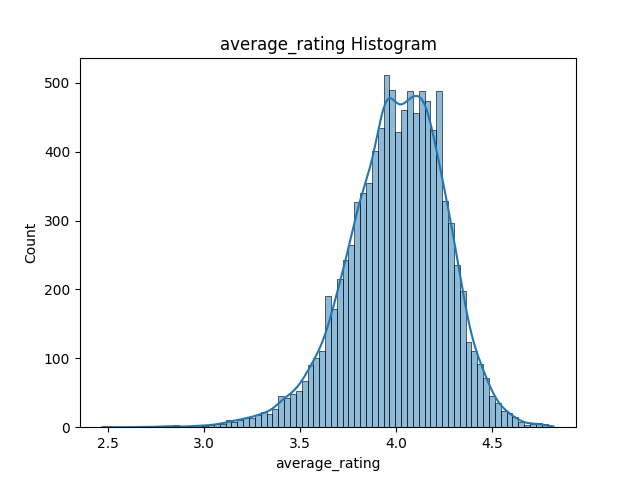
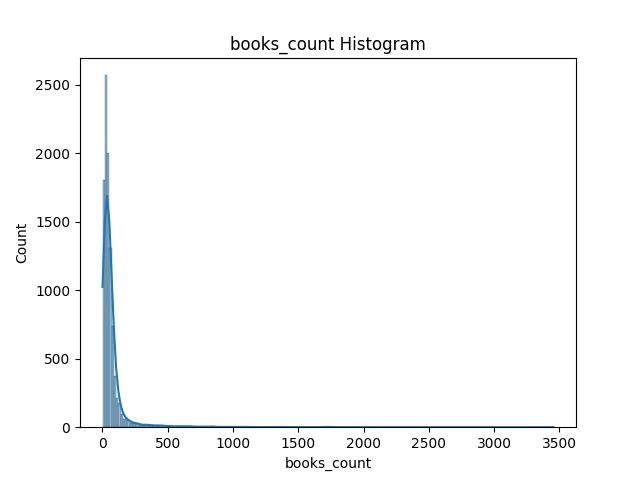
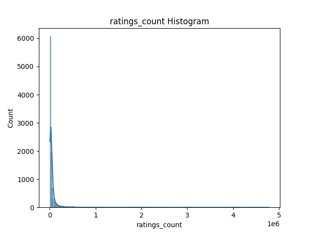
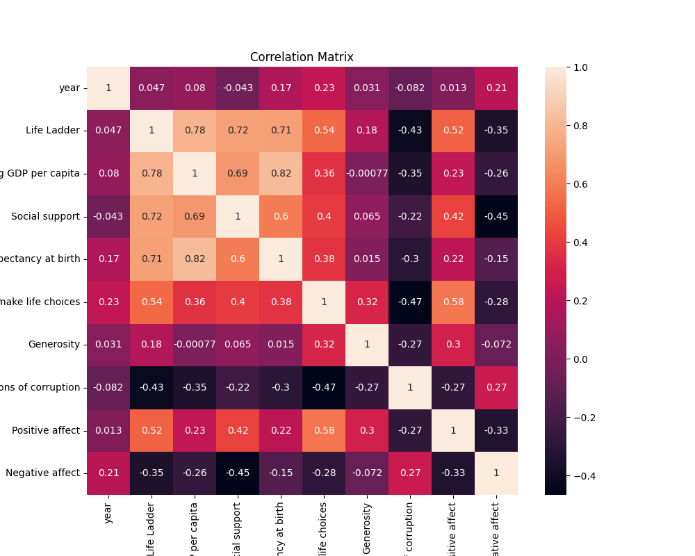

# Goodreads Dataset Analysis

This folder contains visualizations generated from the Goodreads dataset using the autolysis.py script.

## Average Rating Distribution

Shows the distribution of average ratings of books in the dataset.

## Books Count Distribution

Represents the distribution of the number of books written by authors.

## Ratings Count Distribution

Displays how many ratings books receive from readers.

## Correlation Matrix

Shows relationships between numerical variables such as ratings, reviews, and book counts.

## Summary

The analysis highlights trends in book ratings, popularity, and relationships between different book-related metrics in the Goodreads dataset.

