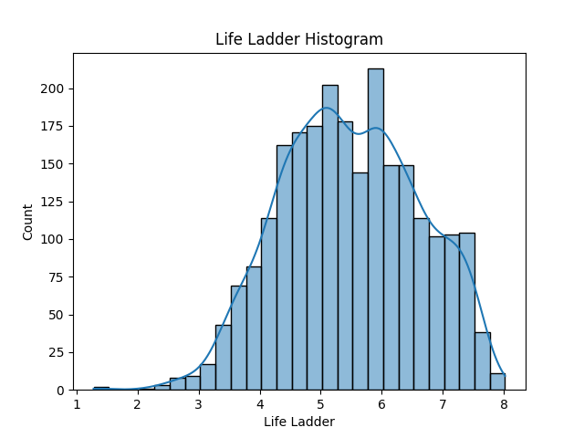
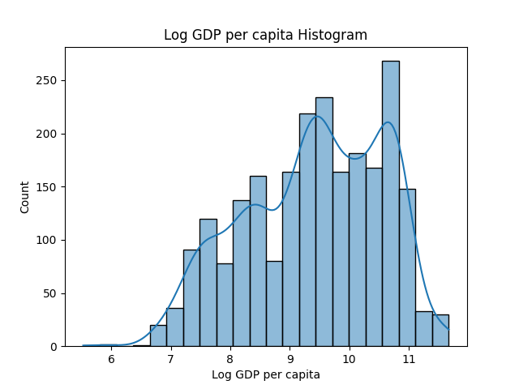
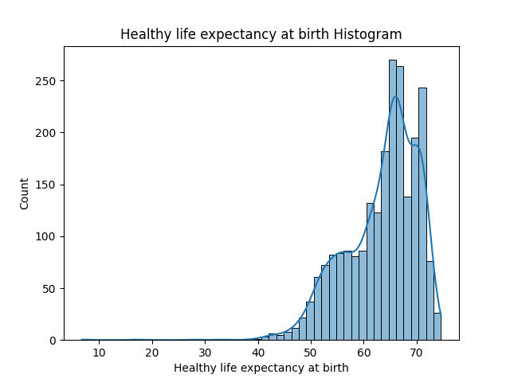
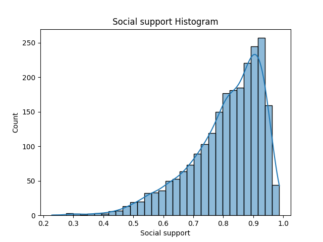

# World Happiness Dataset Analysis

This folder contains visualizations generated from the World Happiness dataset using the autolysis.py script.

## Life Ladder Distribution

Represents the distribution of happiness scores across countries.

## Log GDP per Capita

Shows the relationship between economic prosperity and happiness levels.

## Healthy Life Expectancy

Displays how life expectancy contributes to happiness.

## Social Support

Represents the importance of social connections in determining happiness.

## Summary
The dataset demonstrates that economic conditions, social support, and health significantly influence global happiness levels.
