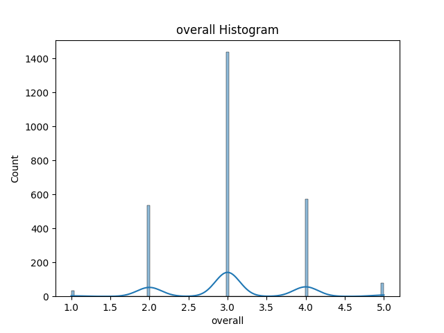
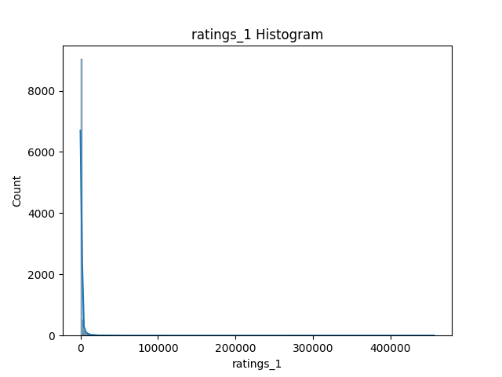
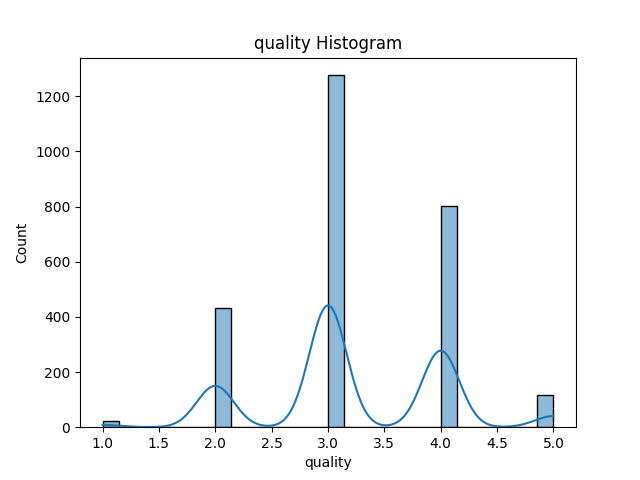

# Media Dataset Analysis

This folder contains visualizations generated from the Media dataset using the autolysis.py script.

## Overall Rating Distribution

Shows the distribution of overall ratings for media items.

## Rating Distribution

Represents how ratings are distributed among users.

## Quality Distribution

Displays the perceived quality levels of media items.

## Summary

The analysis provides insights into rating patterns and quality perception of media items in the dataset.

